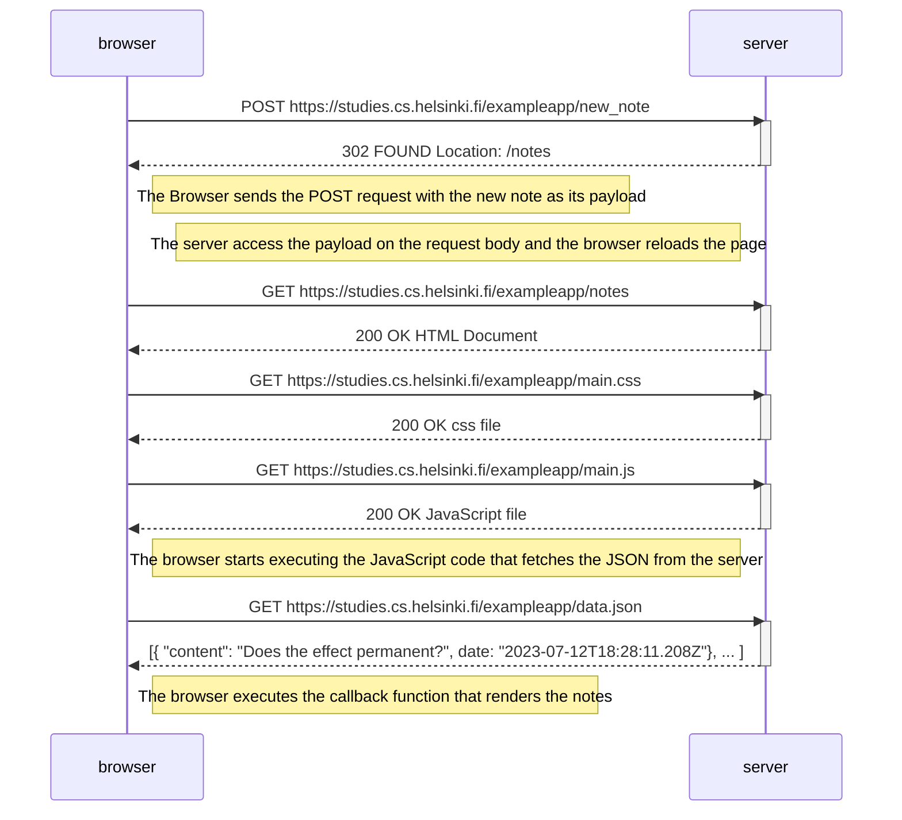
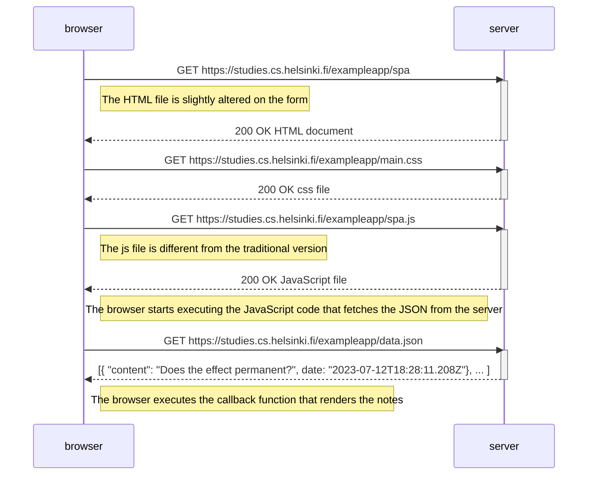
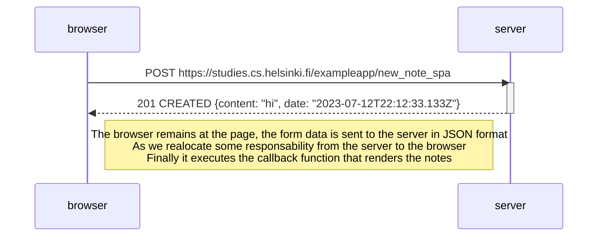

# Part 0: Fundamentals of web apps

## 0.4

```mermaid
sequenceDiagram
    participant browser
    participant server
    

    browser->>server: POST https://studies.cs.helsinki.fi/exampleapp/new_note
    activate server
    server-->>browser: 302 FOUND Location: /notes
    deactivate server

    Note right of browser: The Browser sends the POST request with the new note as its payload
    Note left of server: The server access the payload on the request body and the browser reloads the page

    browser->>server: GET https://studies.cs.helsinki.fi/exampleapp/notes
    activate server
    server-->>browser: 200 OK HTML Document
    deactivate server

    browser->>server: GET https://studies.cs.helsinki.fi/exampleapp/main.css
    activate server
    server-->>browser: 200 OK css file
    deactivate server

    browser->>server: GET https://studies.cs.helsinki.fi/exampleapp/main.js
    activate server
    server-->>browser: 200 OK JavaScript file
    deactivate server
    Note right of browser: The browser starts executing the JavaScript code that fetches the JSON from the server

    browser->>server: GET https://studies.cs.helsinki.fi/exampleapp/data.json
    activate server
    server-->>browser: [{ "content": "Does the effect permanent?", date: "2023-07-12T18:28:11.208Z"}, ... ]
    deactivate server
    Note right of browser: The browser executes the callback function that renders the notes

```

---

## 0.5

```mermaid
sequenceDiagram
    participant browser
    participant server

    browser->>server: GET https://studies.cs.helsinki.fi/exampleapp/spa
    activate server
    Note right of browser: The HTML file is slightly altered on the form
    server-->>browser: 200 OK HTML document
    deactivate server

    browser->>server: GET https://studies.cs.helsinki.fi/exampleapp/main.css
    activate server
    server-->>browser: 200 OK css file
    deactivate server

    browser->>server: GET https://studies.cs.helsinki.fi/exampleapp/spa.js
    activate server
    Note right of browser: The js file is different from the traditional version
    server-->>browser: 200 OK JavaScript file
    deactivate server
    Note right of browser: The browser starts executing the JavaScript code that fetches the JSON from the server

    browser->>server: GET https://studies.cs.helsinki.fi/exampleapp/data.json
    activate server
    server-->>browser: [{ "content": "Does the effect permanent?", date: "2023-07-12T18:28:11.208Z"}, ... ]
    deactivate server
    Note right of browser: The browser executes the callback function that renders the notes
```

## 0.6

---

```mermaid
sequenceDiagram
    participant browser
    participant server

    browser->>server: POST https://studies.cs.helsinki.fi/exampleapp/new_note_spa
    activate server
    server-->>browser: 201 CREATED {content: "hi", date: "2023-07-12T22:12:33.133Z"}
    deactivate server
    Note right of browser: The browser remains at the page, the form data is sent to the server in JSON format <br>As we realocate some responsability from the server to the browser <br>Finally it executes the callback function that renders the notes
```
